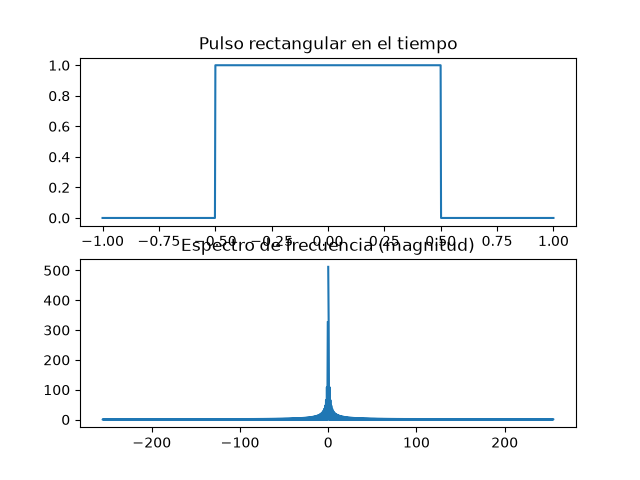
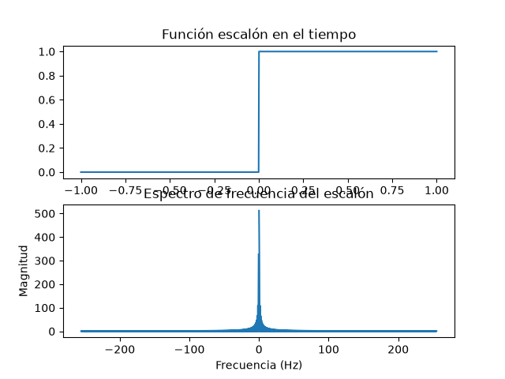
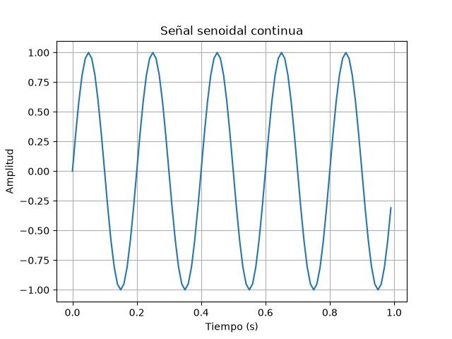
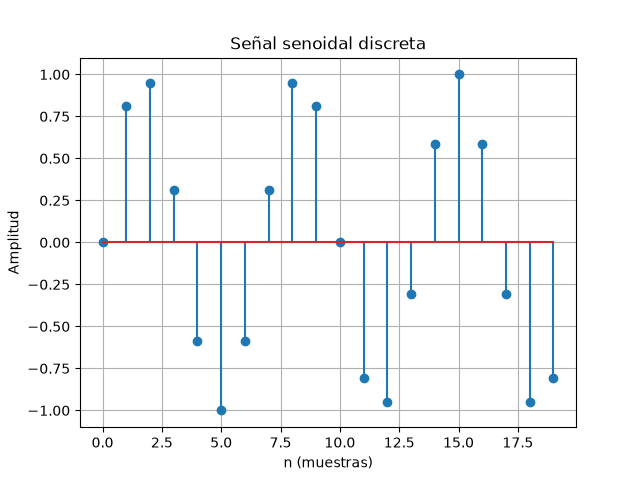

# 🎓 Actividad Formativa 2  
## ✨ Simulación y análisis de señales con la Transformada de Fourier ✨  

---

## 📌 Datos de la actividad
- **Alumno:** Mayra Yeseni Guzmán Soto  
- **Materia:** Señales y Sistemas (A)  
- **Tutor:** Ing. Luis Osvaldo Moreno Gaytán  
- **Carrera:** Ingeniería en Software  
- **Fecha:** Agosto 2026  

---

## 🎯 Objetivo
Analizar señales en el dominio del tiempo y la frecuencia mediante la **Transformada de Fourier**, implementando simulaciones en **Python** con las librerías `numpy` y `matplotlib`.  
Se generaron señales elementales y se calculó su espectro de frecuencia con `np.fft.fft()`.

---

## 📊 Desarrollo de la actividad

### 🔲 Pulso rectangular
El pulso rectangular concentra energía en un intervalo corto de tiempo y presenta un espectro con forma de sinc en el dominio de la frecuencia.  



---

### 📈 Escalón
El escalón representa un cambio permanente en la señal. Su contenido frecuencial se distribuye principalmente en bajas frecuencias.  



---

### 🌊 Señal senoidal continua
La señal senoidal continua presenta picos definidos en la frecuencia fundamental y, dependiendo de la representación, en su frecuencia negativa.  



---

### 🎵 Señal senoidal discreta
La señal senoidal discreta muestra valores en instantes específicos (muestras). Su espectro depende de la frecuencia de muestreo y puede presentar aliasing si no se cumple el teorema de Nyquist.  



---

## ⚙️ Código ejemplo (senoidal continua)

```python
import numpy as np
import matplotlib.pyplot as plt

x = np.arange(0, 1, 0.01)
y = np.sin(2 * np.pi * 5 * x)

plt.plot(x, y)
plt.title("Señal senoidal continua")
plt.xlabel("Tiempo (s)")
plt.ylabel("Amplitud")
plt.grid(True)

plt.savefig("imagenes/senoidal_continua.png")
plt.show()
````
✅ Conclusión
Cada señal tiene un comportamiento característico en el dominio de la frecuencia:

🔲 El pulso rectangular genera un espectro tipo sinc.

📈 El escalón concentra energía en bajas frecuencias.

🌊 La senoidal continua muestra picos definidos en su frecuencia fundamental.

🎵 La senoidal discreta depende de la frecuencia de muestreo y puede presentar aliasing.
