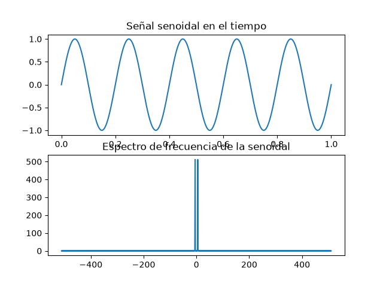

# 🎓 Actividad Formativa 2 – Simulación y análisis de señales con la Transformada de Fourier

👩‍💻 **Alumna:** Mayra Yeseni Guzmán Soto  
📚 **Materia:** Señales y Sistemas (A)  
👨‍🏫 **Tutor:** Ing. Luis Osvaldo Moreno Gaytán  
📅 **Fecha:** Agosto 2026

---

🖥️ **Ingeniería en Software**

---

## 📑 Desarrollo de la actividad

En esta práctica se analizaron señales en el dominio del tiempo y la frecuencia utilizando la **Transformada de Fourier**.

Se implementaron simulaciones en **Python** con las librerías `numpy` y `matplotlib`, generando señales elementales y calculando su espectro de frecuencia mediante la función `np.fft.fft()`.

## 📊 Gráficas y análisis

### Pulso rectangular


El pulso rectangular concentra energía en un intervalo corto de tiempo y presenta un espectro con forma de sinc en el dominio de la frecuencia.

### Escalón


El escalón representa un cambio permanente en la señal. Su contenido frecuencial se distribuye principalmente en bajas frecuencias.

### Senoidal continua



La señal senoidal continua presenta picos definidos en la frecuencia fundamental y, dependiendo de la representación, en su frecuencia negativa.

### Senoidal línea del tiempo


La gráfica permite observar la periodicidad de la señal y verificar que su frecuencia corresponde a la establecida en la simulación.

## 💻 Código utilizado

Ejemplo de la senoidal continua:

```python
import numpy as np
import matplotlib.pyplot as plt

t = np.linspace(0, 1, 1024)
f0 = 5
x = np.sin(2 * np.pi * f0 * t)

X = np.fft.fft(x)
freq = np.fft.fftfreq(len(t), d=t[1] - t[0])

plt.subplot(2, 1, 1)
plt.plot(t, x)
plt.title("Señal senoidal en el tiempo")
plt.xlabel("Tiempo (s)")
plt.ylabel("Amplitud")

plt.subplot(2, 1, 2)
plt.plot(freq, np.abs(X))
plt.title("Espectro de frecuencia de la senoidal")
plt.xlabel("Frecuencia (Hz)")
plt.ylabel("Magnitud")

plt.tight_layout()
plt.savefig("imagenes/senoidal.png")
plt.show()
```
📈 Informe sobre el impacto en el dominio de la frecuencia
El pulso rectangular mostró un espectro amplio con múltiples armónicos.

El escalón concentró energía en bajas frecuencias.

La senoidal continua se concentró en una sola frecuencia.

La senoidal línea del tiempo confirmó la misma pureza espectral.

✅ Conclusiones
La Transformada de Fourier es esencial para comprender fenómenos complejos en telecomunicaciones, audio, imágenes y sistemas de control.

Se verificaron propiedades como la linealidad, el desplazamiento en el tiempo y el escalamiento en frecuencia.

El uso de Python permitió visualizar y comprobar las propiedades de manera práctica.

Publicar el código en GitHub refuerza la importancia de la documentación y el trabajo colaborativo.


Guarda el archivo (`CTRL+O` en nano, luego `CTRL+X` para salir).

---

## 🪜 Paso 3: Crear carpeta de imágenes
En tu terminal:
```bash
mkdir imagenes

plt.savefig("imagenes/nombre.png")

