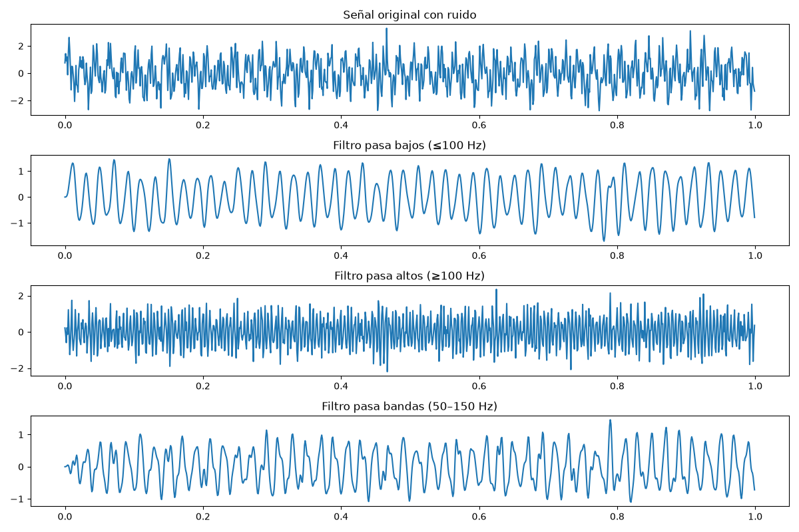

# 🎓 Actividad Formativa 3 – Implementación y Evaluación de Filtros Digitales

👩‍💻 **Alumna:** Mayra Yeseni Guzmán Soto  
📚 **Materia:** Señales y Sistemas (A)  
👨‍🏫 **Tutor:** Ing. Luis Osvaldo Moreno Gaytán  
📅 **Fecha:** Agosto 2026  

---

🖥️ **Ingeniería en Software**

---

## 📑 Desarrollo de la actividad
En esta práctica se implementaron filtros digitales en Python para analizar señales con ruido.  
Se generó una señal compuesta por diferentes frecuencias y se aplicaron filtros pasa bajos y pasa altos utilizando la librería `scipy.signal`.  

Se incluyeron gráficas comparativas entre la señal original y las señales filtradas, mostrando la efectividad de cada filtro en la reducción de ruido y la conservación de componentes útiles.

---

## 📊 Gráficas y análisis
La siguiente gráfica muestra la señal original y el resultado tras aplicar un filtro pasa bajos:



**Análisis:**  
- El filtro pasa bajos eliminó gran parte de las componentes de alta frecuencia.  
- Se conserva la señal de baja frecuencia, mostrando cómo el filtro mejora la calidad de la señal.  

---

## 💻 Código utilizado
El código se desarrolló en **Python** (`Actividad 3.py`) empleando las librerías `numpy`, `matplotlib` y `scipy.signal`.  

Fragmento del código principal:

```python
import numpy as np
import matplotlib.pyplot as plt
from scipy.signal import butter, lfilter

# Señal de prueba
fs = 1000
t = np.linspace(0, 1, fs)
signal = np.sin(2*np.pi*50*t) + np.sin(2*np.pi*200*t) + np.random.randn(len(t))*0.5

# Filtro pasa bajos
b, a = butter(4, 100/(fs/2), btype='low')
filtered_signal = lfilter(b, a, signal)

# Gráficas
plt.figure(figsize=(10,6))
plt.subplot(2,1,1)
plt.plot(t, signal)
plt.title("Señal original con ruido")
plt.subplot(2,1,2)
plt.plot(t, filtered_signal)
plt.title("Señal filtrada (pasa bajos)")
plt.show()

